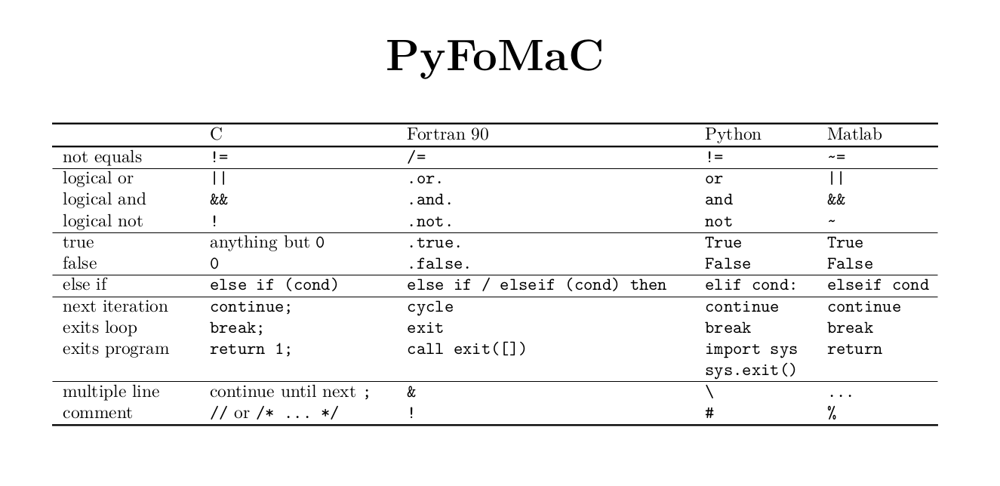
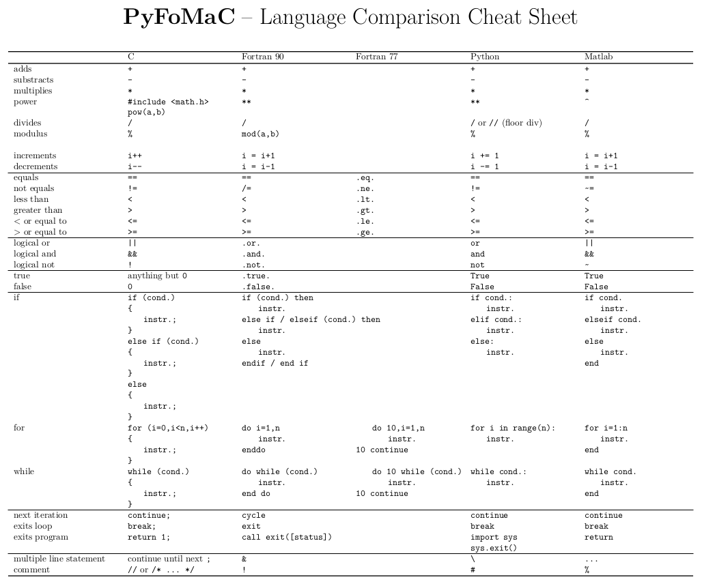

# PyFoMaC - Python, Fortran, Matlab and C language comparison cheat sheet

## Overview

Juggling between programming languages?

//, !, # or % to comment?

"else if", "elseif" or "elif"?

"break" or "exit"?*

This cheat sheet is here to help.

## Versions

* Small version overview

* Large version overview

